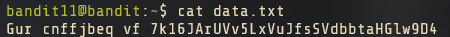

# Level 4



On level 3, we see the simple folder  named _inhere._

<figure><figcaption></figcaption></figure>

When we check the listing for the directory _inhere_, it does not reveal any information. Does this mean that the folder is empty? Not necessarily; lets use additional flags on the command to show all the files present. We will use the `-la` flag which enables long-listing all files.

<figure><figcaption>
Utilizing the flags for the command
</figcaption></figure>

and therefore we can simply use the cat command to find the flag.

<figure><figcaption></figcaption></figure>
